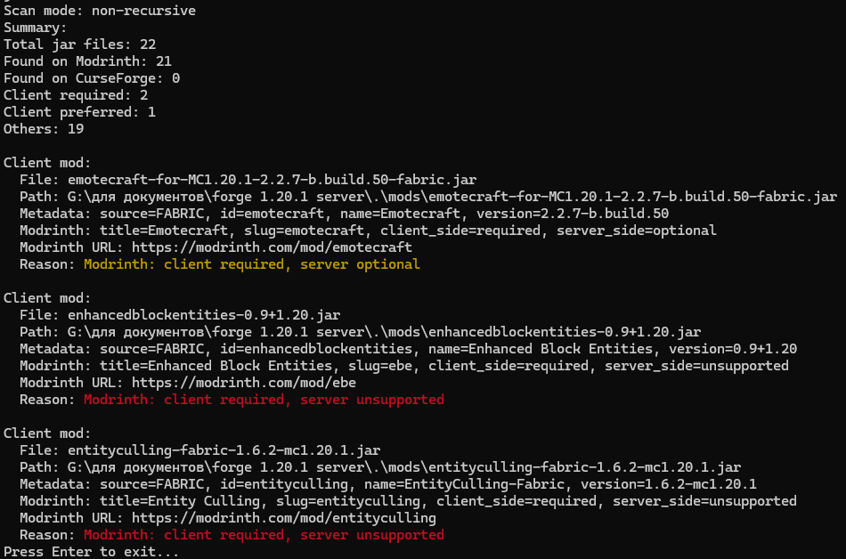

# ModsChecker

CLI tool to audit Minecraft mods and flag client-only mods. It scans a `mods` folder, calculates hashes, and queries Modrinth and CurseForge to classify mods.

## Features
- Modrinth lookup by SHA1.
- CurseForge lookup by fingerprint (batch request).
- Metadata detection from `fabric.mod.json`, `META-INF/mods.toml`, `mcmod.info`.
- Client-only classification + heuristics.
- Console summary and optional JSON report.
- English/Russian output.

## Requirements
- Runtime: Java 8 to 25.
- Build: JDK 17+ (Gradle 8.x requirement).

## Build
```bash
./gradlew build
```
Resulting fat-jar:
```
build/libs/modschecker-1.0.0.jar
```

## Run
```bash
java -jar build/libs/modschecker-1.0.0.jar
```

## Example output


## Configuration file
On first run, a `modschecker.properties` file is created next to the jar (or in the working directory).

Example:
```properties
modsDir=./mods
curseforgeApiKey=
gameId=432
verbose=false
jsonOutput=
language=ru
pauseOnExit=true
```

## CLI options
- `--modsDir <path>`: Mods folder (default `./mods` next to the jar or cwd).
- `--curseforgeApiKey <key>`: API key (or env `CURSEFORGE_API_KEY`).
- `--gameId <int>`: Default `432` (Minecraft).
- `--jsonOutput <path>`: Save JSON report.
- `--verbose`: Print extra diagnostics.
- `--language <lang>`: `ru` or `en`.
- `--pause`: Wait for Enter before exit (default on Windows).
- `--noPause`: Do not wait for Enter.

## Classification rules
A mod is considered client-only if:
- Modrinth `client_side=required` and `server_side=unsupported` (client required), or
- Modrinth `client_side=required` and `server_side=optional` (client preferred).

If Modrinth data is not available, a heuristic is used based on keywords in mod names.

## Notes
- CurseForge is used for identification only (no explicit client/server flags).
- No infinite retries or loops; HTTP timeouts are used.
